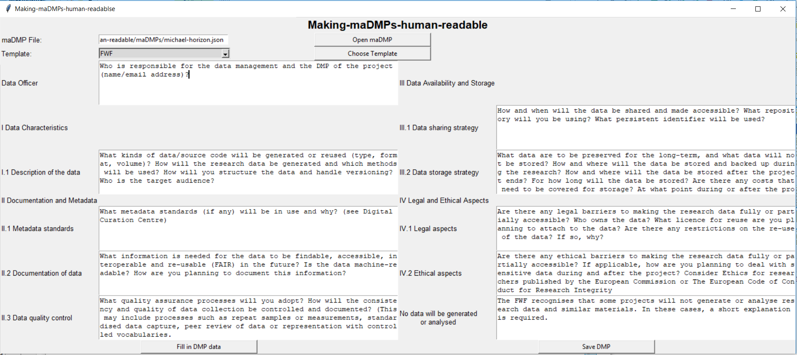

# Usage Example - FWF Template

## 1. Initial Screen

In the initial screen of our tool, users can 
* upload maDMPs in the form of JSON files. Here, a filechooser opens after clicking the according button *Open maDMP*. The chosen maDMP will be shown in the text field left to it, and can still be changed over the whole procedure.
* choose between the FWF and Horizon 2020 template, with the button *Choose Template*.

After a template was chosen - over the combobox shown in the figure -  by the user, the whole screen will be extended, showing options to work with the selected template.

In the following part, the FWF template and its content/options will be described in more detail.

## 2. FWF-specific Screen

After the template is selected, the GUI elements are extended by those shown in figure 2. However, even if a certain template was selected, this can be changed every time while working with our tool.

### Structure of Screen

The screen shows mainly the contents of the FWF template, where each field that needs to be filled in can be edited by the user. We also added a possibility to scroll in the text areas containing the answers according certain questions, if the answers get to big to be displayed
fully in the GUI.

The elements of the FWF template that are editable are:

* Data Officer
* Data Characteristics
    * Description of the data
* Documentation and Metadata
    * Metadata standards
    * Documentation of data
    * Data quality control
* Data Availability and Storage
    * Data Sharing Strategy
    * Data Storage Strategy
* Legal and Ethical Aspects
    * Legal Aspects
    * Ethical Aspects
* No data will be generated or analysed

In the first place, those values are filled out using just the guildlines provided by FWF. This enables the possibility for a user to
use this tool simply for the creation of a DMP.

Still, the purpose should in first place be the conversion of a maDMP into a hrDMP. This will be described in the next section.

### Automatical Creation of hrDMP out of maDMP

Using the button *Fill in DMP data*, the data of the selected maDMP will be translated into an machine-readable form, the text areas with
previously filled in guidelines will be modifed by the translated maDMP data.

The behaviour of this conversion is described in more detail in the section about the
[translation](https://github.com/MBAigner/Making-maDMPs-human-readable/blob/master/docs/translation/translation.md).

### Other Features

Clicking on *Save DMP*, the data filled in by the translation tool and/or modified by the user, will be stored in a PDF file. The conversion of
the text into PDF works over a HTML-styled file. Thus, this version of the data is also available for the user after storing the DMP.

The user can select the path/name of the resulting file again over a filechooser.
